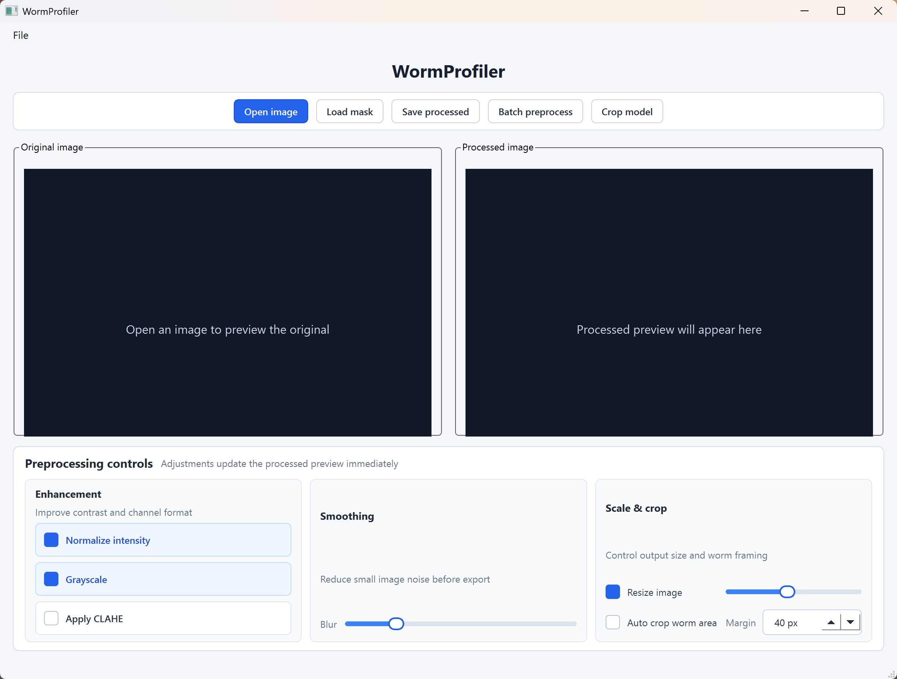
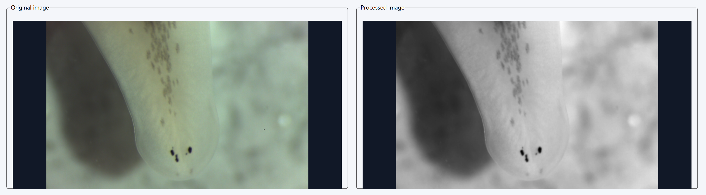
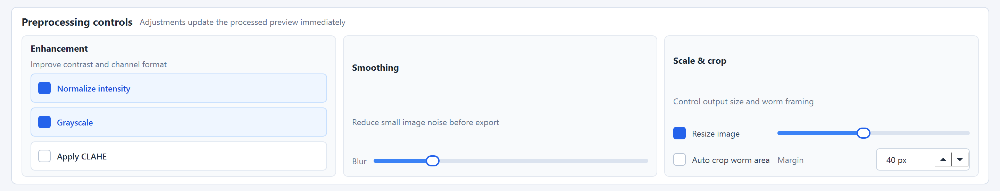
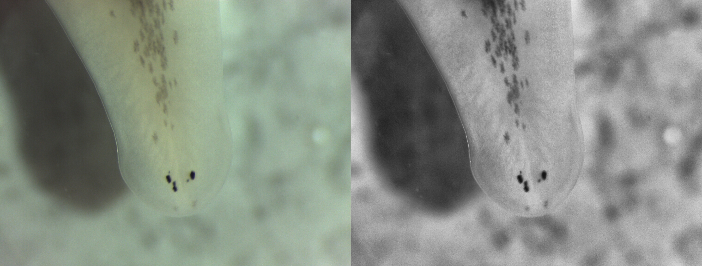
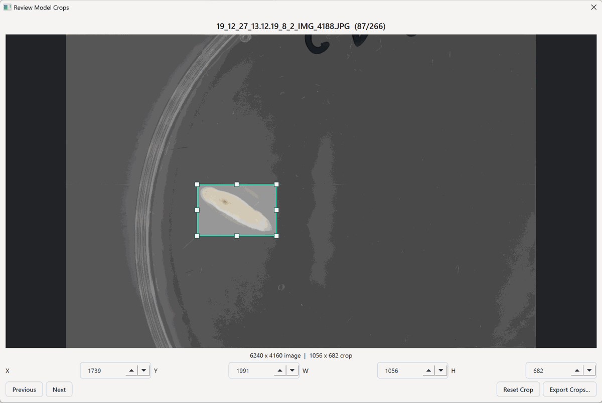
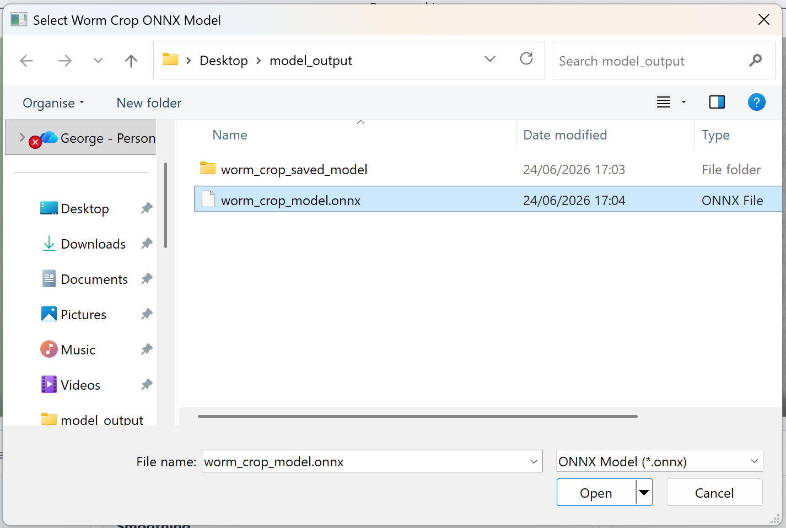

# WormProfiler

WormProfiler is a desktop preprocessing and crop-review tool for worm microscopy images, built with Qt 6 and OpenCV. It is designed to help prepare cleaner, more consistent image sets before downstream analysis in tools such as ilastik.

<p align="center">
  
</p>

The application focuses on a practical lab workflow: open raw worm images, tune preprocessing settings, batch-process folders, generate crop suggestions with a trained ONNX model, review each crop manually, and export clean image crops for segmentation or measurement.

## Application entries

### Side-by-side preprocessing workspace

WormProfiler shows the original image and the processed result next to each other so preprocessing choices can be judged immediately. This makes it easier to tune contrast, blur, grayscale conversion, CLAHE, resizing, and crop settings without losing sight of the raw data.

<p align="center">
  
</p>

### Interactive preprocessing controls

The main window exposes the most common preprocessing operations as direct controls: normalize intensity, convert to grayscale, apply CLAHE, apply Gaussian blur, resize the image, and auto-crop around the worm area. The controls update the processed preview as values change.

<p align="center">
  
</p>

### Intensity normalization

The normalization option rescales image intensities into a consistent display and processing range. This is useful when raw acquisitions differ in brightness, exposure, or background intensity.

### Grayscale and CLAHE enhancement

The grayscale option converts color inputs into single-channel images for workflows that do not need color information. CLAHE can then be applied to improve local contrast, helping faint worm boundaries become easier to inspect and segment.

<p align="center">
  
</p>

### Blur and resize options

The blur slider applies Gaussian blur to reduce small noise before saving or segmentation. The resize option scales images down by a selected percentage, which can make large batches lighter to process while preserving the overall worm shape.

### Classical auto-crop

The auto-crop option uses image processing to estimate the worm region and crop around it with a configurable pixel margin. This gives a fast non-model crop path for images with clear contrast between the worm and background.

<p align="center">
  
</p>

### Model-assisted crop suggestions

WormProfiler can load a trained ONNX crop model and apply it to a folder of raw images. The model predicts a worm probability mask, finds the largest confident worm region, maps that region back to the original image size, and prepares crop rectangles for review.

<p align="center">
  
</p>

### Crop review and manual correction

After model-assisted cropping, each proposed crop opens in a review dialog. The crop box can be moved or resized with handles, and exact X, Y, width, and height values can be adjusted with spin boxes. This keeps automation in the loop without forcing users to accept bad crops.

### Crop export for ilastik

Reviewed crops are exported as PNG files using the approved crop rectangle. The exported image keeps its actual crop dimensions; WormProfiler does not pad crops to a square canvas. This means rectangular and squarer worms can be passed to ilastik as independent 2D images.

<p align="center">
  
</p>

### Mask loading and overlay preview

Existing mask images can be loaded and displayed over the original image with a color map. This is useful for checking segmentation outputs against the raw image before committing to downstream measurements.

### Batch preprocessing

Folder-level batch preprocessing applies the current settings to every supported image in a selected input directory. Processed images are written as PNG files with a `_processed` suffix, making it easy to keep raw and processed data separate.

### Preprocessing profile export

The current preprocessing settings can be saved as a profile file. Profiles record blur strength, normalization, resize scale, grayscale conversion, CLAHE, auto-crop state, and crop margin, which helps document how an image set was prepared.

## Typical workflow

1. Open a representative raw worm image.
2. Tune normalization, grayscale, CLAHE, blur, resize, and crop settings.
3. Save a preprocessing profile for reproducibility.
4. Batch preprocess a folder when the same settings work across the image set.
5. Apply the ONNX crop model to raw images when model-assisted cropping is needed.
6. Review and adjust proposed crop boxes.
7. Export approved crops for ilastik or other segmentation tools.

## Project structure

```text
main.cpp                         # Qt application entry point
CMakeLists.txt                   # Qt 6 and OpenCV build configuration
src/
  io/
    ImageLoader.h/.cpp           # OpenCV image loading and QImage conversion
  preprocessing/
    PreprocessingPipeline.h/.cpp # Blur, normalize, resize, grayscale, CLAHE, auto-crop
    WormCropper.h/.cpp           # ONNX crop model inference and crop rectangle prediction
  ui/
    mainwindow.ui                # Main Qt Designer layout
    mainwindow.h/.cpp            # Main application actions and preprocessing workflow
    CropReviewDialog.h/.cpp      # Manual crop review, adjustment, and export
notebooks/
  worm_crop_segmentation_training_colab.ipynb
                                  # Training notebook for the worm crop segmentation model
docs/
  screenshots/                   # Add GitHub documentation screenshots here
```

## Build requirements

- CMake 3.19 or newer
- Qt 6.5 or newer with the Widgets module
- OpenCV
- A C++ compiler supported by Qt and CMake

## Build from source

```bash
cmake -S . -B build
cmake --build build
```

The application target is `WormProfiler`.

## Supported image inputs

WormProfiler currently accepts common microscopy image formats supported by OpenCV:

- PNG
- JPEG
- BMP
- TIFF

## Crop model notes

The crop model path expects an ONNX model. Internally, WormProfiler converts images to RGB, resizes model input to `256 x 256`, runs inference with OpenCV DNN, thresholds the predicted probability mask, finds the largest connected component, and maps the crop rectangle back to the original image dimensions.

The exported crop itself is taken from the original image using the reviewed rectangle. It is not padded, squared, or resized during crop export.

## Screenshots

README screenshots live in `docs/screenshots/`. Use relative paths because GitHub renders them correctly from the repository root.

```html
<p align="center">
  
</p>
```

Current screenshot files:

- `main-window.png`
- `side-by-side-workspace.png`
- `preprocessing-controls.png`
- `clahe-example.png`
- `auto-crop-result.gif`
- `apply-crop-model.png`
- `exported-crops.png`

See `docs/screenshots/README.md` for capture tips, privacy checks, and table snippets for GitHub.
